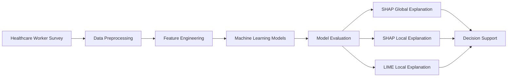

# 🩺 XAI for Primary Vaccine Hesitancy Prediction


An explainable machine learning framework for predicting **COVID-19 primary-dose vaccine hesitancy among Malaysian healthcare workers** using machine learning and Explainable Artificial Intelligence (XAI).

> 🎓 Master's Research Project | Universiti Sains Malaysia (USM)

---

# 📌 Overview

Artificial Intelligence has demonstrated excellent predictive performance in healthcare applications. However, many machine learning models operate as **black-box systems**, making it difficult for healthcare professionals and policymakers to understand the reasoning behind their predictions.

This project develops an **Explainable Artificial Intelligence (XAI) framework** that combines predictive machine learning with **SHAP** and **LIME** explanations to improve transparency and trust in vaccine hesitancy prediction.

The framework predicts primary-dose COVID-19 vaccine hesitancy while providing both **global** and **local** explanations to support evidence-based healthcare decision-making.

---

# 💼 Business Value

Although developed within the healthcare domain, the proposed framework demonstrates how Explainable AI can support real-world decision-making where transparency is essential.

## Ministry of Health (MOH)

- Identify factors influencing vaccine hesitancy.
- Support evidence-based vaccination strategies.
- Design targeted public health interventions.

## Healthcare Organizations

- Understand behavioural barriers affecting vaccine acceptance.
- Improve staff vaccination programmes.
- Support organisational healthcare planning.

## AI Practitioners

- Demonstrate the integration of Explainable AI into healthcare applications.
- Improve trust and transparency of predictive machine learning models.

## Researchers

- Provide an end-to-end explainable machine learning pipeline.
- Demonstrate the practical application of SHAP and LIME for healthcare analytics.

---

# ❗ Problem Statement

Machine learning models can accurately predict vaccine hesitancy but often provide little explanation for their predictions.

In healthcare, prediction accuracy alone is insufficient.

Healthcare professionals and policymakers require transparent and interpretable AI systems that explain:

- Why a prediction was made
- Which factors contributed most
- How different features influence model decisions

This project addresses these challenges by integrating Explainable AI into the machine learning workflow.

---

# 🎯 Objectives

- Develop machine learning models for primary-dose vaccine hesitancy prediction.
- Compare original and aggregated feature representations.
- Evaluate multiple machine learning algorithms.
- Generate global explanations using SHAP.
- Generate local explanations using SHAP and LIME.
- Identify key behavioural and perception-based factors influencing vaccine hesitancy.

---

# 📊 Dataset

The study utilised survey responses collected from **554 Malaysian healthcare workers**.

The dataset includes demographic, behavioural, and perception-related variables associated with COVID-19 vaccination.

### Feature Categories

- Demographics
- Vaccine Confidence
- Perceived Benefits
- Perceived Risks
- Trust and Misinformation
- Health Belief Model (HBM)
- Theory of Planned Behaviour (TPB)

> **Note:** The original dataset cannot be publicly shared due to research ethics approval and participant confidentiality.

---

# 🏗️ System Architecture



---

# ⚙️ Methodology

## 1️⃣ Data Preprocessing

- Missing value handling
- Categorical feature encoding
- Feature normalization
- Dataset preparation

---

## 2️⃣ Feature Engineering

Two feature representations were investigated.

### ALL Features

Uses the complete survey variables.

### AGG Features

Groups related survey variables into higher-level behavioural constructs to improve interpretability while reducing feature dimensionality.

---

## 3️⃣ Machine Learning

The following machine learning models were evaluated:

- K-Nearest Neighbour (KNN)
- Decision Tree (DT)
- Naïve Bayes (GNB, MNB)
- Support Vector Machine (SVM)
- Random Forest (RF)
- Bagging
- Gradient Boosting
- XGBoost

Performance was evaluated using:

- Accuracy
- Precision
- Recall
- F1-score
- ROC-AUC

---

## 4️⃣ Explainable Artificial Intelligence (XAI)

### 🌍 Global Explanation

SHAP was applied to identify globally important features influencing vaccine hesitancy.

Visualisations include:

- SHAP Summary Plot
- SHAP Beeswarm Plot
- SHAP Dependence Plot
- Feature Importance Ranking

---

### 👤 Local Explanation

Individual predictions were interpreted using:

- SHAP Force Plot
- SHAP Waterfall Plot
- LIME Explanation

These explanations provide instance-level insights into how individual features influence model predictions.

---

# 📈 Results

## Best Performing Models

| Feature Representation | Best Model | Accuracy |
|-----------------------|------------|----------|
| ALL Features | Gradient Boosting | **87.39%** |
| AGG Features | Linear SVM | **87.39%** |

---

## Most Important Features (ALL)

- Clinical Trial Confidence
- Vaccine Protection Perception
- Mandatory Vaccination Belief
- General Vaccine Perception
- Age


---

## Most Important Features (AGG)

- Mean Perceived Efficacy & Safety
- Mean Vaccine Misinformation & Trust
- General Vaccine Perception


---

These findings are consistent with established behavioural theories including:

- Health Belief Model (HBM)
- Theory of Planned Behaviour (TPB)

---

# 💡 Key Contributions

- Developed an explainable machine learning framework for vaccine hesitancy prediction.
- Compared original and aggregated feature engineering strategies.
- Evaluated multiple machine learning algorithms.
- Applied SHAP to generate global model explanations.
- Applied SHAP and LIME for local prediction explanations.
- Identified significant behavioural and perception-based factors influencing vaccine hesitancy among Malaysian healthcare workers.

---

# 🛠️ Technology Stack

- Python
- Scikit-Learn
- SHAP
- LIME
- Pandas
- NumPy
- Matplotlib

---

# 📂 Project Structure

```text
xai-primary-vaccine-hesitancy/

├── 01_ALL_features/
├── 02_AGG_features/
├── 03_ALL+AGG_ensemble/
├── 04_explainable_ai/
├── README.md
└── LICENSE
```

---

# 🔒 Data Availability

The original survey dataset contains confidential healthcare worker responses and cannot be publicly distributed.

This repository focuses on the complete modelling methodology and explainability framework.

---

# 🚀 Future Work

Potential future enhancements include:

- Interactive Explainable AI dashboard
- Healthcare decision-support system
- Explainability fusion framework
- Extension to booster-dose vaccine hesitancy prediction
- Integration with Large Language Models (LLMs)

---

# 👨‍💻 Author

**Aqilah Syahirah**

Master of Science (Computer Science)

Interested in:

- Explainable AI (XAI)
- Machine Learning
- Data Engineering
- Healthcare Analytics
